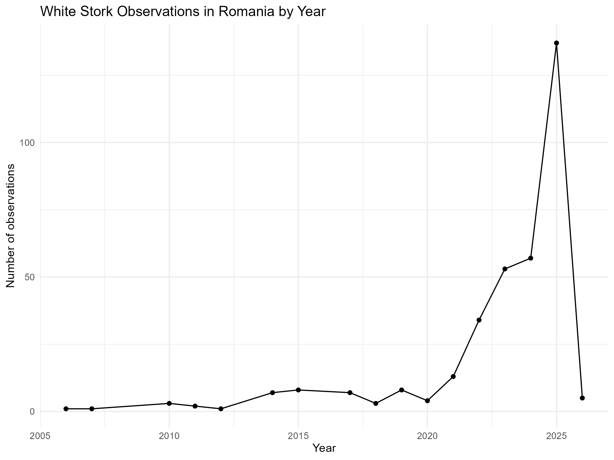
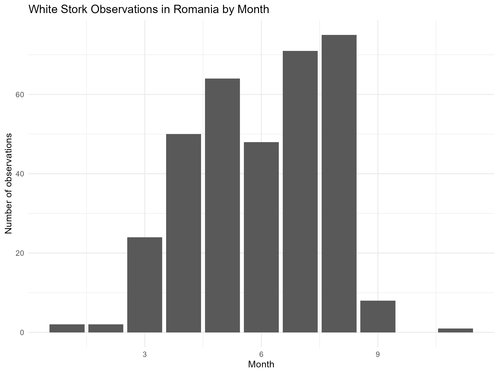
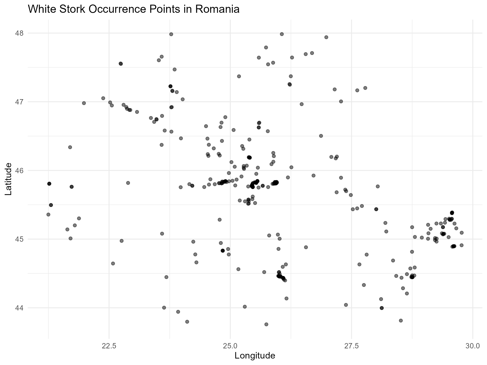

# stork-biodiversity-analysis
Ecological data analysis in R using GBIF data (White Stork, Romania)
# White Stork Biodiversity Analysis (Romania)

This project explores biodiversity data from GBIF for the species *Ciconia ciconia* (White Stork) in Romania.

## Objectives
- Analyze temporal patterns of observations
- Visualize species distribution
- Work with real ecological datasets in R

## Methods
- Data cleaning and filtering
- Temporal analysis (year and month)
- Spatial visualization using geographic coordinates
- Data visualization with ggplot2

## Results

### Observations by Year

### Observations by Month

### Spatial Distribution

## Tools
- R
- tidyverse
- ggplot2
